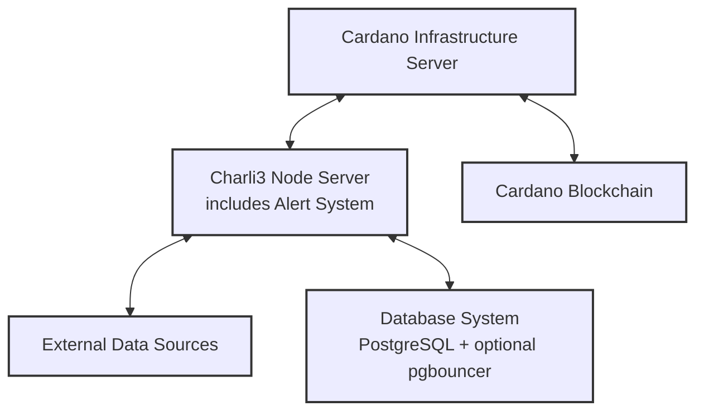

# Architecture Overview of Charli3 Node Operator Backend

This document provides an overview of the system architecture for the Charli3 Node Operator Backend. Understanding this architecture is crucial for effectively setting up, maintaining, and troubleshooting your node.

## 1. High-Level Architecture

The Charli3 Node Operator Backend consists of two main components:

1. Cardano Infrastructure Server
2. Charli3 Node Server

These components work together to interact with the Cardano blockchain and provide oracle services.

## 2. Cardano Infrastructure Server

The Cardano Infrastructure Server is responsible for interacting directly with the Cardano blockchain. It runs three main components:

### 2.1 Cardano Node
- Maintains a full copy of the Cardano blockchain
- Participates in block validation and propagation

### 2.2 Ogmios
- Provides a WebSocket interface to the Cardano node
- Simplifies interaction with the Cardano blockchain

### 2.3 Kupo
- Indexes specific datum and transaction information
- Provides fast and efficient querying of blockchain data

## 3. Charli3 Node Server

The Charli3 Node Server hosts the core functionality of the oracle. It consists of several components:

### 3.1 Oracle Feed / Node Operator Backend Containers
- One container per oracle feed (e.g., ADA/USD, BTC/USD)
- Each container performs all necessary functions for its respective feed:
  - Fetches data from external sources
  - Processes and aggregates data
  - Submits oracle updates to the Cardano blockchain
  - Manages the overall operation for its feed
- These containers use the same image but with different configurations for each feed

### 3.2 Database System
- PostgreSQL Database:
  - Stores historical data and operational metadata
- pgbouncer (Optional):
  - Acts as a connection pooler for the PostgreSQL database
  - Manages and optimizes database connections
  - Improves performance and resource utilization in high-load scenarios

### 3.3 Alert System
- Built-in component of the node backend
- Monitors the node's health and performance
- Generates and sends alerts based on configured thresholds
- Sends notifications through configured channels (e.g., Slack, Discord, Telegram)

## 4. Data Flow

1. External data sources provide real-time price information
2. Oracle feed containers fetch and process this data
3. Processed data is stored in the PostgreSQL database (through pgbouncer if configured)
4. The same containers prepare and send oracle updates
5. Updates are sent to the Cardano Infrastructure Server
6. Cardano node broadcasts the transaction to the Cardano network
7. The built-in Alert System continuously monitors the process and sends notifications if issues are detected

## 5. Network Interaction

- The Charli3 Node Server communicates with the Cardano Infrastructure Server via Ogmios (WebSocket) and Kupo (HTTP)
- External data is fetched using HTTPS connections to various APIs
- The Cardano Infrastructure Server maintains P2P connections with other Cardano nodes

## 6. Security Considerations

- The Cardano Infrastructure Server should be protected behind a firewall, with only necessary ports exposed
- The Charli3 Node Server should ideally be on a separate network from the Cardano Infrastructure Server
- All inter-server communication should be encrypted
- Access to the servers should be strictly controlled and monitored

## 7. Scalability

This architecture allows for horizontal scalability:
- Multiple oracle feed containers can be added as new price pairs are introduced
- The Cardano Infrastructure Server can be scaled independently of the Charli3 Node Server
- Database performance can be optimized by implementing pgbouncer as needed

## 8. Alert and Monitoring Flow

1. The built-in Alert System continuously monitors node performance metrics
2. When a threshold is exceeded, an alert is generated
3. The alert is sent to configured notification channels
4. Node operators receive the alert and take necessary actions

## Conclusion

This architecture provides a robust and scalable solution for operating a Charli3 node. By separating concerns between the Cardano infrastructure and the oracle logic, and incorporating built-in monitoring and alerting, it allows for efficient operation and maintenance of the node.

For more detailed information on setting up and configuring your node, please refer to the [Installation Guide](installation-guide.md) and [Configuration Guide](configuration.md).